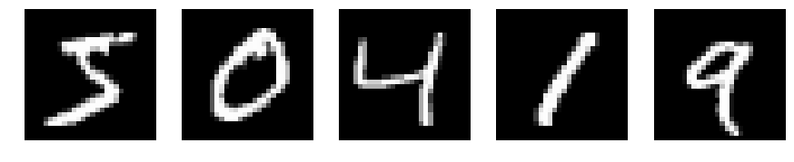

# Preparing MNIST dataset 

1. [Lecun](http://yann.lecun.com/exdb/mnist/)  여기에서 다음 네 개 파일 다운

><span style="color:red">*train-images-idx3-ubyte.gz*   
*train-labels-idx1-ubyte.gz*  
*t10k-images-idx3-ubyte.gz*  
*t10k-labels-idx1-ubyte.gz*
</span>
  
2. python code를 저장할 폴더 내 'data' 폴더를 만든 뒤 각각 압축 해제  

3. [MNIST_load](https://github.com/sjsong08/IDEALab_study/tree/master/Machine%20Learning/MNIST)  여기에서 mnist.zip 다운  

    이 파일은 data폴더의 상위폴더 (작업할 공간)에 압축 해제


4. 작업할 python 코드에서 아래와 같이 Dataset load


```python
import numpy as np
from mnist import MNIST

mndata = MNIST('data')
trX,trY = mndata.load_training()
teX,teY = mndata.load_testing()
training_data  = np.asarray(trX)
test_data      = np.asarray(teX)

# One_Hot Encoding
targets = np.asarray(trY).reshape(-1)
one_hot_targets = np.eye(10)[targets]
training_label = one_hot_targets
targets = np.asarray(teY).reshape(-1)
one_hot_targets = np.eye(10)[targets]
test_label = one_hot_targets
```

# MNIST DATA
MNIST data는 training data 60000개, test data 10000개로 이루어져 있고,  
각 이미지의 dimension은 [28 x 28] = 784 개로 구성 됨.


```python
import matplotlib.pyplot as plt
%matplotlib inline
print('training data : '),
print(training_data.shape[0])
print('test data     : '),
print(test_data.shape[0])

plt.figure(figsize=[15,5])
for i in range (5):
    plt.subplot(1,5,i+1)
    image = np.reshape(training_data[i], [28,28])
    plt.imshow(image, cmap='gray')
    plt.gca().axis('off')
plt.show()
```

    training data :  60000
    test data     :  10000
    





### 앞으로 사용할 변수는
- 학습 데이터  &emsp;&emsp;&emsp;&emsp; : training_data  
- 학습 데이터의 정답  &ensp;&nbsp; : training_label  
- 테스트 데이터&emsp;&emsp;&emsp;&ensp;: test_data  
- 테스트 데이터의 정답 : test_label


```python

```
